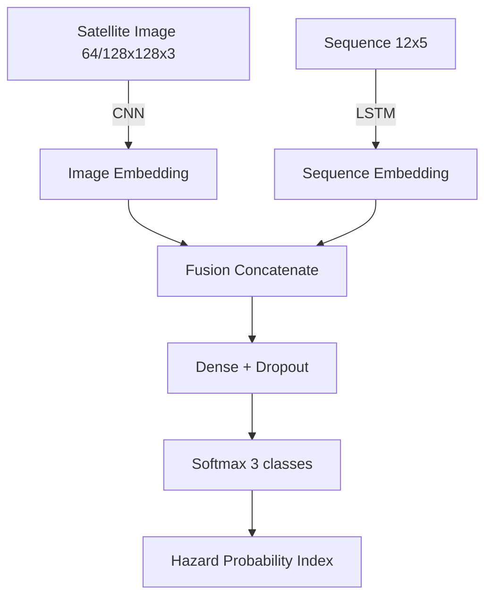

# Multi-Modal CNN + LSTM Hybrid Architecture for Ocean Wave Disaster Prediction

## Abstract
This project builds a research-grade, multimodal early-warning system that fuses satellite spectral imagery with oceanographic time-series signals to classify ocean wave risk levels (NORMAL, MODERATE, GIANT) and surface a Hazard Probability Index (HPI). The system targets rapid prototyping on GPU (Colab) and optional edge alerting via Arduino + GSM.

## Project Overview
- **Image branch (CNN):** Sentinel/MODIS/Landsat style inputs at 64×64 or 128×128, extracting spatial/spectral cues (texture, SST regions, SAR roughness).
- **Sequence branch (LSTM):** 12-timestep sequences with 5 features each (Hs, Hmax, SST, WindSpeed, PeakWaveDirection).
- **Fusion:** Concatenate CNN + LSTM embeddings → dense layers with dropout → 3-class softmax.
- **Outputs:** Class label, probability vector, Hazard Probability Index (expected value with weights [0, 0.5, 1.0]), confusion matrix, training curves.

## Repository Structure
```
src/
	data_loader.py       # CSV/images loading, sequence shaping, tf.data pipeline
	preprocess.py        # label encoding, stratified splits, feature column helpers
	model_cnn_lstm.py    # CNN+LSTM fusion model (simple + MobileNetV2 backbones)
	train.py             # argparse training entrypoint with callbacks
	evaluate.py          # reports, confusion matrix, HPI, predictions CSV
	inference.py         # single-sample inference + optional serial out
	api.py               # FastAPI service for real-time monitoring + web interface
	realtime/            # Real-time data fetching modules
		open_meteo.py    # Open-Meteo Marine API client
		ndbc.py          # NDBC buoy data fetcher
		usgs_earthquake.py  # USGS earthquake catalog
		tsunami_bulletins.py  # PTWC/NTWC RSS feeds
		data_utils.py    # Tensor preparation utilities
web/
	templates/           # HTML templates for web interface
		index.html       # Main web application page
	static/              # Static assets (CSS, JavaScript)
		styles.css       # Web interface styling
		app.js           # Interactive functionality
	README.md            # Web interface documentation
notebooks/
	multimodal_training.ipynb  # Colab-ready training/eval notebook
arduino/
	wave_alert.ino       # LCD + buzzer + GSM SMS alert sketch
models/                # saved models (best_model.h5, scalers, logs)
data/                  # dataset.csv, images/, etc.
requirements.txt
README.md
```

## Data Expectations
- `dataset.csv` columns:
	- `image`: filename of the satellite image (located in `IMAGE_DIR`).
	- `label`: NORMAL | MODERATE | GIANT.
	- Flattened sequence columns (default): `t0_Hs, t0_Hmax, t0_SST, t0_WindSpeed, t0_PeakWaveDirection, ... t11_*`.
- Images: RGB, readable by OpenCV, resized to 64×64 or 128×128.

## Model Architecture (Mermaid)


## Quickstart (Web Interface)

The easiest way to use the system is through the web interface:

### Option 1: One-Command Start (Recommended)

**Linux/Mac:**
```bash
./start_web.sh
```

**Windows:**
```bash
start_web.bat
```

### Option 2: Manual Start

1) Install dependencies:
```bash
pip install -r requirements.txt
```

2) Start the web server:
```bash
cd src
python -m uvicorn api:app --reload --host 0.0.0.0 --port 8000
```

3) Open your browser:
```
http://localhost:8000
```

### Using the Interface

- **Click on the interactive map** to select any ocean location
- **Use preset buttons** for quick access to major oceans (Bay of Bengal, Arabian Sea, etc.)
- **Enter custom coordinates** manually for precise locations
- **View real-time predictions** with hazard levels and probability scores
- **Monitor tsunami activity** with recent earthquakes and official bulletins

See `web/README.md` for detailed web interface documentation.

## Quickstart (Local Training)
1) Create env & install deps
```bash
python -m venv .venv && source .venv/bin/activate
pip install -r requirements.txt
```
2) Train (simple CNN backbone)
```bash
python src/train.py \
	--csv_path data/dataset.csv \
	--image_dir data/images \
	--output_dir models/run1 \
	--image_size 128 --seq_len 12 --seq_features 5 \
	--batch_size 32 --epochs 20
```
3) Evaluate
```bash
python src/evaluate.py \
	--csv_path data/dataset.csv \
	--image_dir data/images \
	--model_path models/run1/best_model.h5 \
	--scaler_path models/run1/sequence_scaler.pkl \
	--output_dir models/run1/eval
```
4) Inference (single sample)
```bash
python src/inference.py \
	--model_path models/run1/best_model.h5 \
	--scaler_path models/run1/sequence_scaler.pkl \
	--image_path data/images/example.jpg \
	--sequence "0.5,0.7,24.1,6.3,220, ..." \
	--seq_len 12 --seq_features 5
```

## Google Colab Flow
- Open `notebooks/multimodal_training.ipynb` in Colab.
- Install deps, optionally clone the repo, mount Drive, set paths, run training and evaluation cells.

## Data Fetching (Earth Engine / Copernicus / NOAA)
- Auth steps:
	- Earth Engine: `pip install earthengine-api`; run `earthengine authenticate` (CLI) or `ee.Authenticate()` in a notebook, then `ee.Initialize()`.
	- Copernicus/ERA5: install `cdsapi`; create `~/.cdsapirc` with `url: https://cds.climate.copernicus.eu/api` and `key: <uid>:<api-key>`.
	- Sentinel Hub (optional fallback): set env vars `SH_CLIENT_ID`, `SH_CLIENT_SECRET`.
- CLI example to fetch data for a bbox:
```bash
python src/data_fetcher.py --bbox 85 10 95 20 --start_date 2023-07-01 --end_date 2023-07-07 --out_dir data/fetched --img_size 128 --seq_len 12 --seq_features 5
```
- India presets (free EE + ERA5 fetch covering all coastal waters):
```bash
# Whole coastline (Arabian Sea + Bay of Bengal)
python src/data_fetcher.py --preset india_all --start_date 2023-07-01 --end_date 2023-07-07 --out_dir data/india_all

# Bay of Bengal only
python src/data_fetcher.py --preset bay_of_bengal --start_date 2023-07-01 --end_date 2023-07-07 --out_dir data/bob
```
- Notebook example: see `notebooks/example_data_fetch.ipynb` (Bay of Bengal sample) for Colab with Drive outputs.
- Outputs: `dataset.csv` (image path + flattened sequence), `images/` tiles, `summary.json`, and `sequence_scaler.pkl`.

## Outputs
- `best_model.h5`, `last_model.h5`, `sequence_scaler.pkl`, `label_mapping.json`.
- `history.json`, `training_curves.png` (loss/acc), `test_metrics.json`.
- `reports/predictions.csv`, `classification_report.json`, `confusion_matrix.png`/`.npy`.
- Hazard Probability Index in both evaluation and inference outputs.

## Arduino + GSM Alert (Optional)
- Sketch: `arduino/wave_alert.ino`.
- Expects serial messages like `LABEL:GIANT;HPI:0.87;P_GIANT:0.92` from `src/inference.py` with `--serial_port` set.
- Displays risk on 16×2 LCD, buzzes for MODERATE/GIANT, sends SMS via SIM800L for GIANT.

## Real-Time Data Pipeline and Monitoring API

### Overview
The real-time monitoring system fetches live oceanographic data from free APIs and provides REST endpoints for disaster prediction and tsunami monitoring.

### Data Sources
- **Open-Meteo Marine API**: Wave height, direction, period, wind speed/direction forecasts
- **NOAA NDBC**: Real-time buoy observations from National Data Buoy Center
- **USGS Earthquake Catalog**: Recent earthquake events (potential tsunami triggers)
- **PTWC/NTWC**: Authoritative tsunami bulletins from Pacific and National Tsunami Warning Centers

### Quick Start (FastAPI Service)

1) Install dependencies:
```bash
pip install -r requirements.txt
```

2) Start the API server:
```bash
# From project root
cd src
python -m uvicorn api:app --reload --host 0.0.0.0 --port 8000
```

3) Access the API:
- Interactive docs: http://localhost:8000/docs
- Root endpoint: http://localhost:8000/

### API Endpoints

#### `/predict` - Live Prediction
Generate real-time wave disaster predictions for a location:
```bash
curl "http://localhost:8000/predict?latitude=36.78&longitude=-122.40"
```

Response:
```json
{
  "predicted_class": "NORMAL",
  "hazard_probability_index": 0.1234,
  "probabilities": {
    "NORMAL": 0.85,
    "MODERATE": 0.12,
    "GIANT": 0.03
  },
  "confidence": 0.85,
  "location": {"latitude": 36.78, "longitude": -122.40},
  "data_sources": {"open_meteo": true, "ndbc": true}
}
```

Optional parameters:
- `use_ndbc`: Enable NDBC buoy data (default: true)
- `model_path`: Path to trained model (uses mock prediction if not provided)
- `scaler_path`: Path to feature scaler

#### `/bulletins` - Tsunami Warnings
Fetch authoritative tsunami bulletins:
```bash
curl "http://localhost:8000/bulletins?active_only=true"
```

Parameters:
- `sources`: Comma-separated list (ptwc, ntwc)
- `active_only`: Filter for active warnings/advisories only

#### `/earthquakes` - Recent Seismic Activity
Get recent earthquakes with tsunami potential:
```bash
curl "http://localhost:8000/earthquakes?min_magnitude=6.0&tsunami_risk_only=true&target_lat=36.78&target_lon=-122.40"
```

Parameters:
- `min_magnitude`: Minimum magnitude (default: 5.0)
- `hours_back`: Hours of history (default: 24)
- `tsunami_risk_only`: Filter for tsunami-capable events
- `target_lat`, `target_lon`: Calculate tsunami ETA to this location

#### `/marine-data` - Raw Ocean Data
Fetch raw marine observations/forecasts:
```bash
# Open-Meteo forecast
curl "http://localhost:8000/marine-data?latitude=36.78&longitude=-122.40&source=open-meteo"

# NDBC buoy data
curl "http://localhost:8000/marine-data?latitude=36.78&longitude=-122.40&source=ndbc&station_id=46042"
```

#### `/health` - Health Check
```bash
curl "http://localhost:8000/health"
```

### Usage Examples

#### Python Client
```python
import httpx

# Get live prediction
response = httpx.get(
    "http://localhost:8000/predict",
    params={"latitude": 36.78, "longitude": -122.40}
)
prediction = response.json()
print(f"Hazard Level: {prediction['predicted_class']}")
print(f"Hazard Index: {prediction['hazard_probability_index']:.3f}")

# Check for tsunami warnings
response = httpx.get(
    "http://localhost:8000/bulletins",
    params={"active_only": True}
)
bulletins = response.json()
if bulletins['count'] > 0:
    print(f"⚠️  {bulletins['count']} active tsunami bulletin(s)")
```

#### JavaScript/Fetch
```javascript
// Get prediction
fetch('http://localhost:8000/predict?latitude=36.78&longitude=-122.40')
  .then(res => res.json())
  .then(data => {
    console.log(`Risk Level: ${data.predicted_class}`);
    console.log(`Hazard Index: ${data.hazard_probability_index}`);
  });

// Monitor earthquakes
fetch('http://localhost:8000/earthquakes?tsunami_risk_only=true')
  .then(res => res.json())
  .then(data => {
    console.log(`${data.count} tsunami-capable earthquakes in last 24h`);
  });
```

### Data Fetcher Modules (Python API)

You can also use the data fetchers directly in Python:

```python
from src.realtime.open_meteo import fetch_open_meteo_marine, prepare_wave_features
from src.realtime.ndbc import fetch_ndbc_latest, find_nearest_station
from src.realtime.usgs_earthquake import fetch_usgs_earthquakes
from src.realtime.tsunami_bulletins import fetch_tsunami_bulletins

# Fetch marine forecast
marine_data = fetch_open_meteo_marine(latitude=36.78, longitude=-122.40)
wave_features = prepare_wave_features(marine_data)

# Find and fetch from nearest buoy
station = find_nearest_station(36.78, -122.40)
if station:
    buoy_data = fetch_ndbc_latest(station, data_type="txt")

# Get recent earthquakes
earthquakes = fetch_usgs_earthquakes(min_magnitude=5.0, hours_back=24)

# Fetch tsunami bulletins
bulletins = fetch_tsunami_bulletins(sources=["ptwc", "ntwc"])
```

### Deployment Notes

- **Production**: Use a production ASGI server (gunicorn + uvicorn workers)
- **Model**: Provide `model_path` and `scaler_path` query parameters or configure as environment variables
- **Rate Limits**: External APIs have rate limits; implement caching for production use
- **Authentication**: Add API key authentication for production deployments
- **CORS**: Enable CORS if serving web clients from different domains

## Reproducibility Tips
- Set `--seed` flag during training.
- Keep consistent `seq_columns` ordering if customizing features.
- For MobileNetV2 backbone, add `--use_mobilenet` (requires 128×128x3 input by default).

## License
MIT