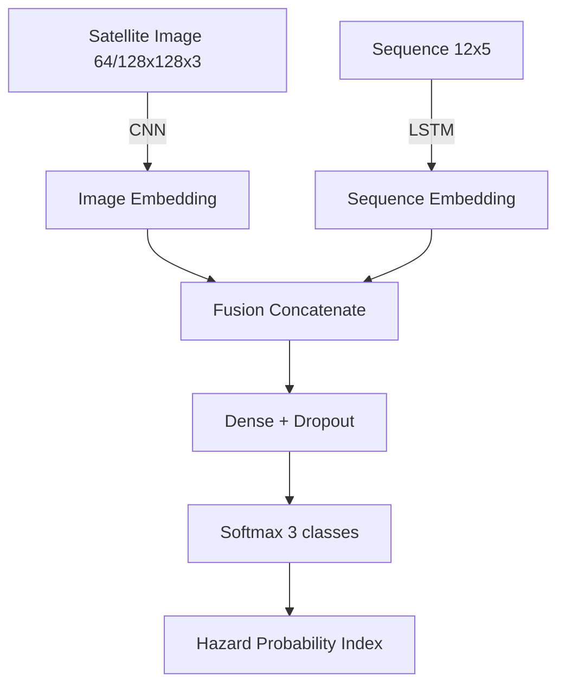

# Multi-Modal CNN + LSTM Hybrid Architecture for Ocean Wave Disaster Prediction

## Abstract
This project builds a research-grade, multimodal early-warning system that fuses satellite spectral imagery with oceanographic time-series signals to classify ocean wave risk levels (NORMAL, MODERATE, GIANT) and surface a Hazard Probability Index (HPI). The system targets rapid prototyping on GPU (Colab) and optional edge alerting via Arduino + GSM.

## Project Overview
- **Image branch (CNN):** Sentinel/MODIS/Landsat style inputs at 64×64 or 128×128, extracting spatial/spectral cues (texture, SST regions, SAR roughness).
- **Sequence branch (LSTM):** 12-timestep sequences with 5 features each (Hs, Hmax, SST, WindSpeed, PeakWaveDirection).
- **Fusion:** Concatenate CNN + LSTM embeddings → dense layers with dropout → 3-class softmax.
- **Outputs:** Class label, probability vector, Hazard Probability Index (expected value with weights [0, 0.5, 1.0]), confusion matrix, training curves.

## Repository Structure
```
src/
	data_loader.py       # CSV/images loading, sequence shaping, tf.data pipeline
	preprocess.py        # label encoding, stratified splits, feature column helpers
	model_cnn_lstm.py    # CNN+LSTM fusion model (simple + MobileNetV2 backbones)
	train.py             # argparse training entrypoint with callbacks
	evaluate.py          # reports, confusion matrix, HPI, predictions CSV
	inference.py         # single-sample inference + optional serial out
notebooks/
	multimodal_training.ipynb  # Colab-ready training/eval notebook
arduino/
	wave_alert.ino       # LCD + buzzer + GSM SMS alert sketch
models/                # saved models (best_model.h5, scalers, logs)
data/                  # dataset.csv, images/, etc.
requirements.txt
README.md
```

## Data Expectations
- `dataset.csv` columns:
	- `image`: filename of the satellite image (located in `IMAGE_DIR`).
	- `label`: NORMAL | MODERATE | GIANT.
	- Flattened sequence columns (default): `t0_Hs, t0_Hmax, t0_SST, t0_WindSpeed, t0_PeakWaveDirection, ... t11_*`.
- Images: RGB, readable by OpenCV, resized to 64×64 or 128×128.

## Model Architecture (Mermaid)


## Quickstart (Local)
1) Create env & install deps
```bash
python -m venv .venv && source .venv/bin/activate
pip install -r requirements.txt
```
2) Train (simple CNN backbone)
```bash
python src/train.py \
	--csv_path data/dataset.csv \
	--image_dir data/images \
	--output_dir models/run1 \
	--image_size 128 --seq_len 12 --seq_features 5 \
	--batch_size 32 --epochs 20
```
3) Evaluate
```bash
python src/evaluate.py \
	--csv_path data/dataset.csv \
	--image_dir data/images \
	--model_path models/run1/best_model.h5 \
	--scaler_path models/run1/sequence_scaler.pkl \
	--output_dir models/run1/eval
```
4) Inference (single sample)
```bash
python src/inference.py \
	--model_path models/run1/best_model.h5 \
	--scaler_path models/run1/sequence_scaler.pkl \
	--image_path data/images/example.jpg \
	--sequence "0.5,0.7,24.1,6.3,220, ..." \
	--seq_len 12 --seq_features 5
```

## Google Colab Flow
- Open `notebooks/multimodal_training.ipynb` in Colab.
- Install deps, optionally clone the repo, mount Drive, set paths, run training and evaluation cells.

## Data Fetching (Earth Engine / Copernicus / NOAA)
- Auth steps:
	- Earth Engine: `pip install earthengine-api`; run `earthengine authenticate` (CLI) or `ee.Authenticate()` in a notebook, then `ee.Initialize()`.
	- Copernicus/ERA5: install `cdsapi`; create `~/.cdsapirc` with `url: https://cds.climate.copernicus.eu/api` and `key: <uid>:<api-key>`.
	- Sentinel Hub (optional fallback): set env vars `SH_CLIENT_ID`, `SH_CLIENT_SECRET`.
- CLI example to fetch data for a bbox:
```bash
python src/data_fetcher.py --bbox 85 10 95 20 --start_date 2023-07-01 --end_date 2023-07-07 --out_dir data/fetched --img_size 128 --seq_len 12 --seq_features 5
```
- India presets (free EE + ERA5 fetch covering all coastal waters):
```bash
# Whole coastline (Arabian Sea + Bay of Bengal)
python src/data_fetcher.py --preset india_all --start_date 2023-07-01 --end_date 2023-07-07 --out_dir data/india_all

# Bay of Bengal only
python src/data_fetcher.py --preset bay_of_bengal --start_date 2023-07-01 --end_date 2023-07-07 --out_dir data/bob
```
- Notebook example: see `notebooks/example_data_fetch.ipynb` (Bay of Bengal sample) for Colab with Drive outputs.
- Outputs: `dataset.csv` (image path + flattened sequence), `images/` tiles, `summary.json`, and `sequence_scaler.pkl`.

## Outputs
- `best_model.h5`, `last_model.h5`, `sequence_scaler.pkl`, `label_mapping.json`.
- `history.json`, `training_curves.png` (loss/acc), `test_metrics.json`.
- `reports/predictions.csv`, `classification_report.json`, `confusion_matrix.png`/`.npy`.
- Hazard Probability Index in both evaluation and inference outputs.

## Arduino + GSM Alert (Optional)
- Sketch: `arduino/wave_alert.ino`.
- Expects serial messages like `LABEL:GIANT;HPI:0.87;P_GIANT:0.92` from `src/inference.py` with `--serial_port` set.
- Displays risk on 16×2 LCD, buzzes for MODERATE/GIANT, sends SMS via SIM800L for GIANT.

## Reproducibility Tips
- Set `--seed` flag during training.
- Keep consistent `seq_columns` ordering if customizing features.
- For MobileNetV2 backbone, add `--use_mobilenet` (requires 128×128x3 input by default).

## License
MIT